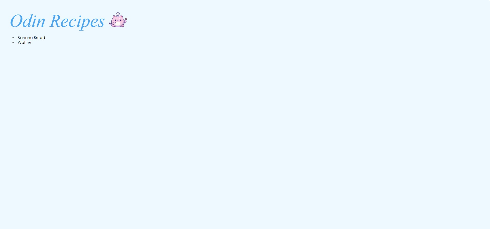
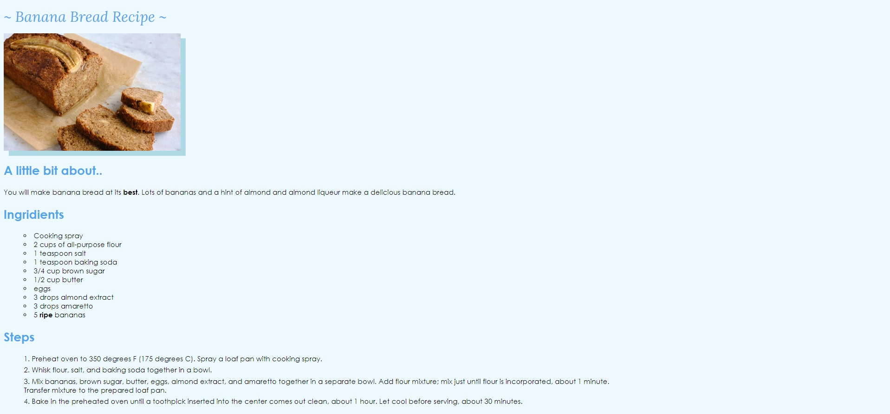

# Odin Recipes Project

### Foundations
The goal of this repo is to re-familiarize myself with the fundamentals of HTML and CSS. A noninclusive list of topics covered are as follows:

- HTML boilerplate & common elements
- External CSS
  - ID, Class, and Type Selectors
  - Inheritance & Specificity
  - Grouping & Chaining Selectors
  - Descendant Combinator(s)
  - Rule Order (Cascade)
- Git Fundamentals
  - Atomic commits

# Links
- [Live Demo](https://pb-5.github.io/recipes-html-basics/)

# Screenshots

## Main Page

## Recipe Page

